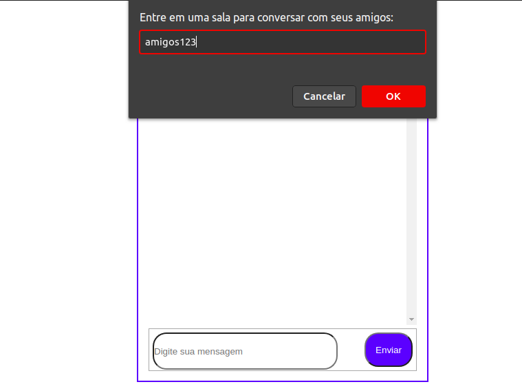
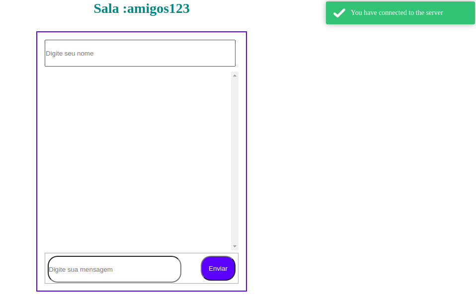
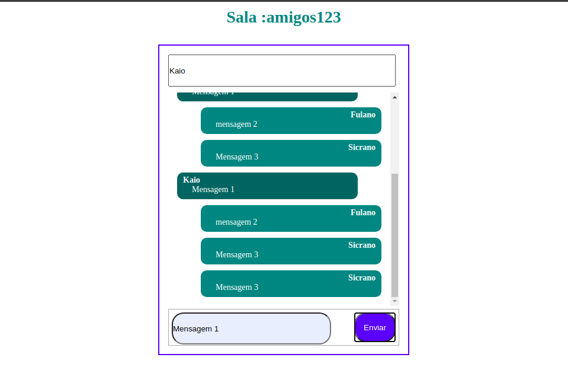

# My chat with Socket.io
Criação de um chat em tempo real com o socket.io.

# Screenshots

* Entrar na sala (Se não existir, cria automaticamente)  

          

 

* Mensagem de confimação  

          

 

* Conversa com as pessoas logadas na sala  

          

 

# Exemplos de uso

* `` io.on("connection", (client) => {...} ``  
  * _Disparado quando o usuário entra na aplicação_

* `` client.emit('message', "this is a test"); ``  
  * _Enviar apenas para o cliente atual_

* `` io.emit('message', "this is a test"); ``  
  * _Enviar para todos os clientes, inclusive o atual_

* `` client.broadcast.emit('message', "this is a test"); ``  
  * _Enviar para todos os clientes, exceto o atual_

* `` socket.broadcast.to('game').emit('message', 'nice game'); ``  
  * _Enviar para todos os clientes (com exceção do atual) para uma sala específica_

* `` io.in('game').emit('message', 'cool game'); ``  
  * _Enviar para todos os clientes em uma sala específica_

* `` client.to('game').emit('message', 'enjoy the game'); ``  
  * _Enviar para o atual, caso ele esteja na sala_

* `` io.of('namespace1').emit('message', 'gg'); ``  
  * _Enviar para todos os clientes em um namespace 'namespace1'_

* `` client.broadcast.to(socketid).emit('message', 'for your eyes only'); ``  
  * _Enviando para um socketid individual_
  
## Autor

|  |
| ----------------------------- |
| 
 <a href="https://github.com/kaio-giovanni"> @kaio-giovanni </a> 
|
